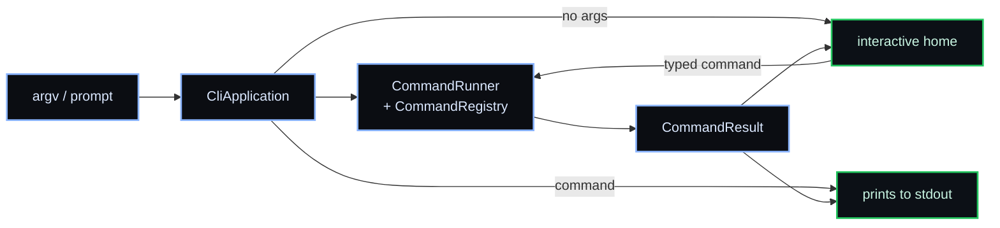

<div align="center">


# Dacely CLI

### Ship from your terminal.

<sub>The CLI for <a href="https://dacely.com">Dacely</a>, the application cloud for modern fullstack apps.</sub>

<br/>

[](https://www.npmjs.com/package/dacely)

</div>

---

## Install

```bash
npm install -g dacely      # global `dacely` command
npx dacely --help          # or run once, no install
```

Requires Node.js >= 24. Runs on Node, Bun, and Deno.

## Usage

Run `dacely` with no arguments for the interactive home, then type a slash command like `/help`, `/login`, or `/deploy`. The same commands run directly from your shell and in CI:

```bash
dacely login           # or: dacely --login
dacely deploy --prod
dacely projects
dacely --help          # -h
dacely --version       # -v
```

> Commands are rendered placeholders today; wiring them to the Dacely API is in progress.

## Commands

| Command    | Aliases      | Description                                     |
| ---------- | ------------ | ----------------------------------------------- |
| `help`     | `?`          | List the available commands                     |
| `login`    | `signin`     | Sign in to your Dacely account                  |
| `logout`   | `signout`    | Sign out of the current session                 |
| `whoami`   |              | Show the currently signed-in account            |
| `projects` | `ls`, `list` | List your Dacely projects                       |
| `deploy`   | `ship`       | Deploy the current directory to the Dacely edge |
| `status`   |              | Show the latest deployment status               |
| `logs`     |              | Stream logs from your deployment                |
| `env`      |              | Manage environment variables                    |
| `link`     |              | Link the current directory to a Dacely project  |
| `version`  | `ver`        | Print the CLI version                           |
| `clear`    | `cls`        | Clear the screen (interactive)                  |
| `exit`     | `quit`       | Exit the interactive prompt                     |

## Architecture

Pure types in `src/types/`, class-based domain logic in `src/classes/` (one class per command), and the terminal UI in `src/components/`.



## Development

```bash
npm install       # install dependencies
npm run dev       # run from source with hot reload (tsx)
npm run build     # typecheck and bundle to build/cli.js
npm test          # vitest with coverage
npm run test:all  # lint + typecheck + tests
```

See [CONTRIBUTING.md](./CONTRIBUTING.md) for conventions and contribution terms.

## License

[Business Source License 1.1](./LICENSE). Free to install, run, use, modify, and redistribute (including commercially); the only restriction before the Change Date is offering it as a competing hosted or managed service. Converts to [Apache-2.0](./LICENSE-APACHE-2.0.txt) on **2030-07-10**.

Copyright (c) 2026 Dacely &lt;business@dacely.com&gt;. See [NOTICE](./NOTICE) and [THIRD-PARTY-NOTICES.md](./THIRD-PARTY-NOTICES.md).
