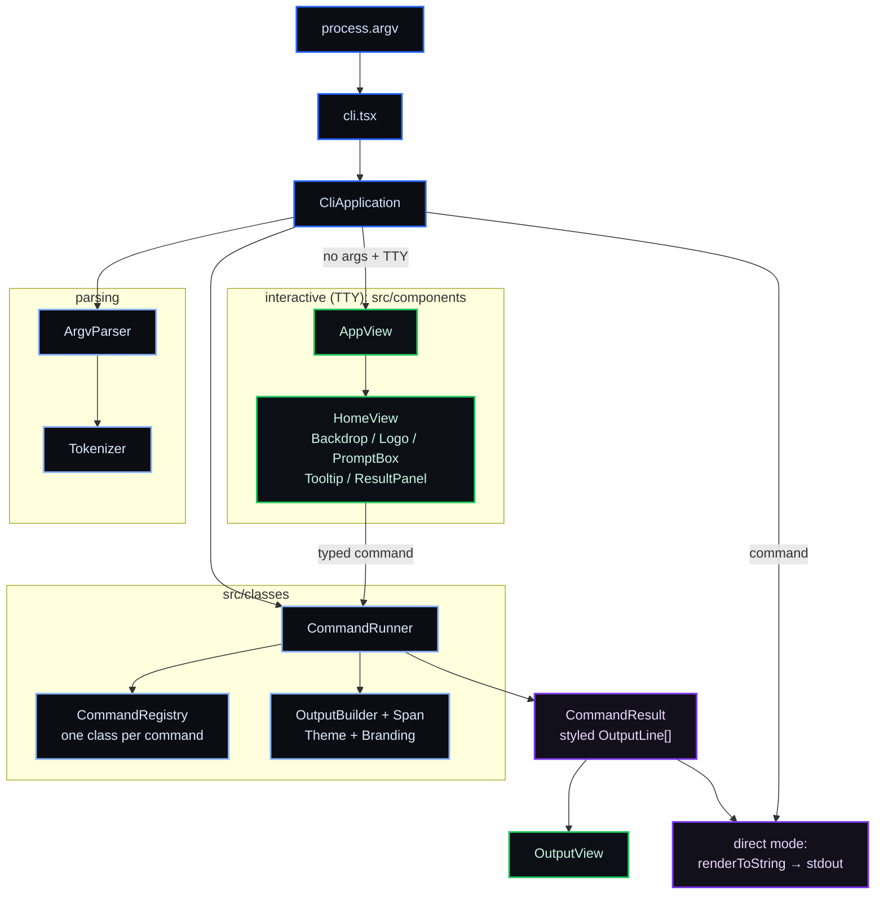

<div align="center">


# Dacely CLI

### Ship from your terminal.

#### The command-line interface for [Dacely](https://dacely.com), the application cloud for modern fullstack apps.

<sub>A beautiful <b>Ink + React</b> terminal experience: a full-screen home with the Dacely mark, a live prompt, and slash commands, plus first-class <code>dacely &lt;command&gt;</code> scripting for your shell and CI.</sub>

<sub><b>TypeScript in. Global edge out.</b></sub>

<br/>

**⚡ Two ways to drive it.** An interactive REPL for humans, and a scriptable direct mode for pipes and CI, from one binary.

**⚡ Zero-config, everywhere.** Runs on Node, Bun, and Deno. Degrades gracefully when there is no TTY.

<br/>

[](https://www.npmjs.com/package/dacely)
[](https://www.typescriptlang.org/)
[](https://nodejs.org/)
[](https://github.com/vadimdemedes/ink)
[](https://react.dev/)
[](./LICENSE)

<br/>


</div>

---

<details>
<summary><b>Table of contents</b></summary>
<br/>

1. [Install](#install)
2. [Two ways to run](#two-ways-to-run)
3. [The interactive home](#the-interactive-home)
4. [Commands](#commands)
5. [Architecture](#architecture)
6. [Development](#development)
7. [License](#license)

</details>

---

The Dacely CLI is how you talk to Dacely from your terminal. It is built as a real terminal application, not a wall of `console.log`: the interactive mode is a full-screen [Ink](https://github.com/vadimdemedes/ink) + React interface with the Dacely mark, a centered prompt box, and slash commands, all rendered on a subtle backdrop that recenters as you resize. The exact same commands run non-interactively as `dacely <command>`, so anything you can do by hand you can also script in CI, and the output pipes cleanly.

Under the hood it is a small, strict, object-oriented codebase: one class per command, a registry, a runner, and a themed output builder, with the UI as a tree of React class components. Everything is type-checked, linted, and tested.

```bash
npm install -g dacely
dacely
```

That drops you into the interactive home:

```text
       ▀██████████▄▄
         ▀███████████▄     ██████╗  █████╗  ██████╗███████╗██╗     ██╗   ██╗
           ▀██████████▄    ██╔══██╗██╔══██╗██╔════╝██╔════╝██║     ╚██╗ ██╔╝
             ▀█████████    ██║  ██║███████║██║     █████╗  ██║      ╚████╔╝
             ▄█████████    ██║  ██║██╔══██║██║     ██╔══╝  ██║       ╚██╔╝
           ▄██████████▀    ██████╔╝██║  ██║╚██████╗███████╗███████╗   ██║
         ▄███████████▀     ╚═════╝ ╚═╝  ╚═╝ ╚═════╝╚══════╝╚══════╝   ╚═╝
       ▄██████████▀▀

                  the application cloud for modern fullstack apps

         ╭──────────────────────────────────────────────────────────────╮
         │ ❯ run a command, or /help                                    │
         ╰──────────────────────────────────────────────────────────────╯

                   /help   /login   /deploy   /projects   /logs
                     ↵ run    ·    ctrl+c exit    ·    v0.0.1
```

> **Status:** the command surface and UX are complete and rendered; wiring the commands to the Dacely API is in progress. Every command currently returns its intended output as a placeholder.

## Install

```bash
npm install -g dacely      # global `dacely` command
# or run once without installing:
npx dacely --help
```

Requires Node.js >= 24. The published bundle targets modern ES runtimes and runs on Node, Bun, and Deno.

## Two ways to run

**Interactive.** Run `dacely` with no arguments for the full-screen home. Type a slash command such as `/help`, `/login`, or `/deploy`, and its result appears in a panel above the prompt. Press Ctrl-C or type `/exit` to leave.

**Direct.** Every command also runs straight from your shell, as a subcommand or a flag, so the same tool works in scripts and CI:

```bash
dacely help            # or: dacely --help,  dacely -h
dacely login           # or: dacely --login
dacely deploy --prod
dacely projects
dacely --version       # or: dacely -v
```

If stdin is not a terminal (a pipe, or CI), the interactive home cannot capture keystrokes, so the CLI falls back to printing `help` instead of failing.

## The interactive home

The home screen is composed entirely of Ink React class components:

- a **backdrop** of a faint dotted lattice, sized to the terminal and recentered on resize,
- the **Dacely mark** (a faithful trace of the logo) beside the `DACELY` wordmark,
- a bordered **prompt box** with a live input,
- a **tooltip** of common commands and key bindings,
- and a **result panel** that shows the output of your last command.

The palette matches [dacely.com](https://dacely.com): white on black with a single sky-blue accent, no theme required.

## Commands

| Command     | Aliases        | Description                                       |
| ----------- | -------------- | ------------------------------------------------- |
| `help`      | `?`            | List the available commands                       |
| `login`     | `signin`       | Sign in to your Dacely account                    |
| `logout`    | `signout`      | Sign out of the current session                   |
| `whoami`    |                | Show the currently signed-in account              |
| `projects`  | `ls`, `list`   | List your Dacely projects                         |
| `deploy`    | `ship`         | Deploy the current directory to the Dacely edge   |
| `status`    |                | Show the latest deployment status                 |
| `logs`      |                | Stream logs from your deployment                  |
| `env`       |                | Manage environment variables                      |
| `link`      |                | Link the current directory to a Dacely project    |
| `version`   | `ver`          | Print the CLI version                             |
| `clear`     | `cls`          | Clear the screen (interactive)                    |
| `exit`      | `quit`         | Exit the interactive prompt                       |

## Architecture

The project is organized into three layers with a strict object-oriented core. Pure types live in `src/types/`, all domain logic is classes in `src/classes/`, and the UI in `src/components/` is a tree of React class components.



## Development

Requires Node.js >= 24. We use npm.

```bash
npm install       # install dependencies
npm run dev       # run the CLI from source with hot reload (tsx)
npm start         # run the CLI from source once
npm run build     # typecheck and bundle to build/cli.js (esbuild)
npm run typecheck # strict TypeScript type check
npm run lint      # ESLint, strict and type-checked
npm test          # vitest with coverage
npm run test:all  # lint + typecheck + tests
```

See [CONTRIBUTING.md](./CONTRIBUTING.md) for conventions and the contribution terms.

## License

The Dacely CLI is licensed under the **Business Source License 1.1** ([LICENSE](./LICENSE)). You may install, run, use, modify, and redistribute it for any purpose, including commercially. The only thing BUSL restricts before the Change Date is offering it to third parties as a hosted, managed, or standalone product or service that competes with Dacely (for that, contact business@dacely.com).

On the **Change Date, 2030-07-10**, it converts to the **Apache License, Version 2.0** ([LICENSE-APACHE-2.0.txt](./LICENSE-APACHE-2.0.txt)).

Copyright (c) 2026 Dacely &lt;business@dacely.com&gt;. All rights not expressly granted are reserved; see [NOTICE](./NOTICE). Third-party components and their licenses are listed in [THIRD-PARTY-NOTICES.md](./THIRD-PARTY-NOTICES.md).

<div align="center">
<sub>Built by Dacely. TypeScript in. Global edge out.</sub>
</div>
